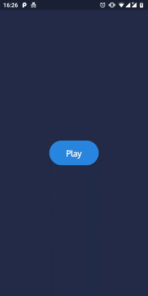
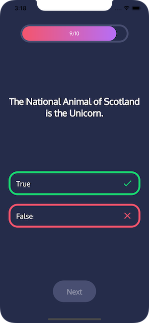
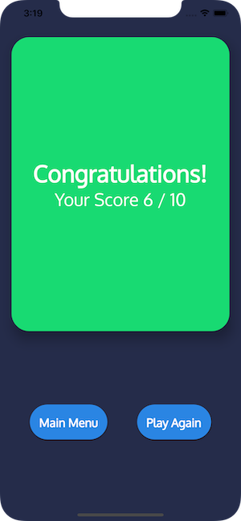

# quiz

A simple quiz app built using Flutter. Design inspired by [Quiz App UI - Oma](https://dribbble.com/shots/6508352-Quiz-App-UI-Oma) by [JD](https://dribbble.com/Jaydev).

## Screenshots

|                       |                              |                              |                              |
|-----------------------|------------------------------|------------------------------|------------------------------|
|  |  |  |  |

## Technical Info

- There are three screens in the app.
    - `HomeScreen` simply contains a play button which when pressed starts the quiz.
    - `GameScreen` loads the quiz questions and displays a `Quiz` widget which in turn consists of many smaller widgets.
    - `ResultScreen`shows the player's quiz result, with the option to play again to return or the main menu.
- `setState` is used as the project's state management solution.
- `QuizService` downloads a list of `Question`s from [opentdb.com](https://opentdb.com/api.php).
